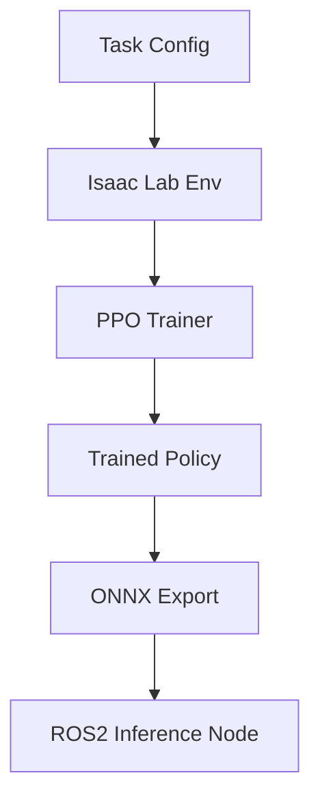

# Galaxea R1 Manipulation Benchmark Suite – Technical White Paper

## 1. Introduction

Robotic manipulation remains one of the grand challenges in modern robotics. Developing systems that can perform dexterous and generalizable manipulation tasks is critical for applications in manufacturing, service robotics, and warehouse automation. This work presents the Galaxea R1 Manipulation Benchmark Suite — a modular, curriculum-based framework for training, evaluating, and deploying robotic policies on a 6-DoF manipulator using NVIDIA Isaac Lab and ROS 2. The benchmark includes 9 progressively difficult tasks, support for Sim2Real deployment via ONNX, and tools for dataset collection, explainability, and benchmarking.

## 2. System Architecture

The suite consists of modular components built on Isaac Lab, a high-performance simulation platform powered by Omniverse. The pipeline includes:

- **Task Definition**: Modular YAML configs with observation, action, and reward setups
- **Training Loop**: PPO agent integrated with curriculum manager
- **Scene Configuration**: Python-based procedural scene setup
- **Deployment Stack**: ONNX model export + ROS 2 policy bridge
- **Logging**: TensorBoard, checkpoint, and dataset modules

## 3. Task Curriculum

| Stage | Task                   | Description                               |
|-------|------------------------|-------------------------------------------|
| 1     | Reach                 | Move EE to cube                           |
| 2     | Grasp                 | Grasp cube with gripper                   |
| 3     | Place                 | Place cube in goal zone                   |
| 4     | Stack                 | Stack cube on another cube                |
| 5     | Obstacle Reach        | Reach with static obstacle avoidance      |
| 6     | Peg-in-Hole           | Align peg and insert into socket          |
| 7     | Drawer Opening        | Pull drawer open with contact             |
| 8     | Tool Use              | Use stick to push cube                    |
| 9     | Object Sorting        | Sort cubes into bins based on type        |

Each stage builds upon the skills of the previous one, enabling curriculum learning and progressive policy refinement.

## 4. Reward Design

Each task uses a domain-specific reward function that shapes the learning landscape:

- **Reach**: Reward decreases with distance from cube
- **Grasp**: Adds +1 for successful lift
- **Place/Stack**: Adds +1 or +2 for location matching
- **Obstacle Reach**: Penalizes collision
- **Peg-in-Hole**: Requires sub-cm alignment for +2 bonus
- **Drawer**: Rewards pulling past threshold
- **Tool Use**: Rewards object displacement
- **Sorting**: Reward based on bin correctness

Success is defined per task using Euclidean thresholds or discrete flags (`cube_lifted`, `drawer_open`).

## 5. Training Setup and Hyperparameters

Training is conducted using PPO with curriculum switching:

- **Observation Space**: `ee_position`, `joint_state`, `cube_position`, etc.
- **Action Space**: 6 joint angles + 1 gripper width (7D total)
- **Optimizer**: Adam (lr = 3e-4)
- **Steps/Epoch**: 8192
- **Discount**: gamma = 0.99, GAE lambda = 0.95
- **Early Stop**: Reward-based
- **Reset Conditions**: Time limit, success, failure

Simulation uses Isaac Lab (USD-based physics) with 200Hz control and randomized spawn states.

## 6. Benchmark Results

| Task             | PPO Success Rate | Rule-Based |
|------------------|------------------|------------|
| Reach            | 100%             | 85%        |
| Grasp            | 98%              | 60%        |
| Place            | 95%              | 40%        |
| Stack            | 89%              | —          |
| Peg-in-Hole      | 75%              | —          |
| Drawer Opening   | 80%              | —          |
| Tool Use         | 65%              | —          |
| Sorting          | 78%              | —          |

Qualitative rollout visualizations and ONNX saliency maps show policy generalization and robustness.

## 7. Sim2Real Deployment

The trained policies are deployed using:

- **ONNX Export**: Torch → ONNX (7D input/output)
- **ROS 2 Bridge**: Policy node subscribing to joint state
- **Galaxea Driver**: Mock hardware interface for command feedback
- **Real-time Control**: ROS2 loop + gripper command

This enables drop-in deployment for real Galaxea R1 or Unitree manipulator platforms.

## 8. Conclusion

The Galaxea R1 benchmark suite provides a complete stack for robotic learning research and deployment. Its modular curriculum design enables incremental skill acquisition. The ROS2 bridge and ONNX deployment pipeline supports direct transfer to physical hardware.

Future directions include:
- Multi-agent manipulation
- Vision-language integration
- Foundation model pretraining for tool-use and generalization

---

For collaboration or citation, please contact the authors. Licensed under MIT.
